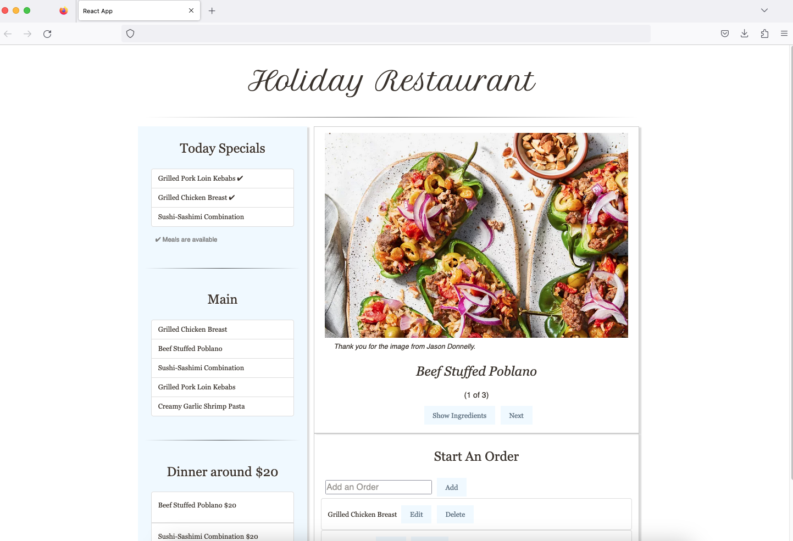

<h1 align="center">Holiday Restaurant website</h1>
This project is built using CodeSandbox, to view the project, please visit [Demo](https://codesandbox.io/p/github/juliisstudy/Holiday-Restaurant).

## About the Project
I implemented the Holiday Restaurant website for learning and practicing React.js. It contains several sections. 
- **Today Special**
This section displays the availability of special dishes that use the **Conditional Rendering** method.
- **Main Course**
This section displays a list of the main courses by using the Array.map() method.
- **Dinner around a Certain Price**
This section displays a list of courses whose price is 20, which uses the Array.filter() method.
* **Course Images sections**
This section displays images of the main courses, and users are able to navigate to the next course by clicking the “Next”. Users can view more detail about the ingredients by clicking the “show Ingredients” button. 
* **Start an Order**
In this section, users are able to add an order to the order list, edit, and delete the order.

(<a href="#readme-top">back to top</a>)

**### Built With**
- [React.js](https://react.dev/)
- [Bootstrap](https://getbootstrap.com/)
